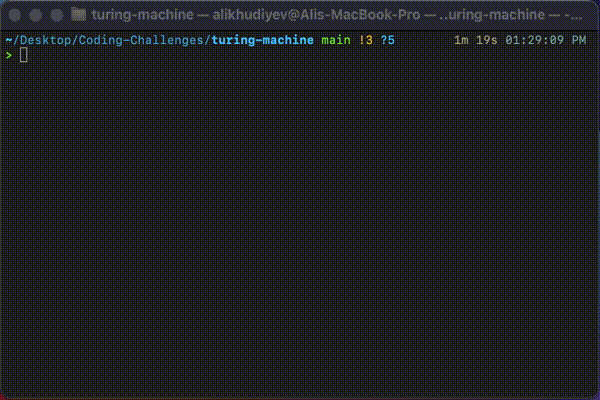

# Binary addition

Two binary numbers are written on a tape with the "+" sign between them and the program will print result of the summation onto the first number and will change the second number into 11...1. If the second number is not in the form of 11...1 then the inputs are ill-formed.

The following shows the addition process of **00101 + 01001** which is equal to **01110**.

*Note:* The given strings do not need to have the same length(i.e. **00101 + 1001** will also work as expected).

