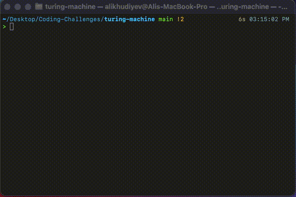

# Language detection

This program detects the language defined by **L = {1^n 2^n | n >= 0}**. If the given string is in the form of language L then it prints "Y". Otherwise it prints "N" onto the tape.

Language to be tested: **11212122**

Language to be tested: **112121222**

