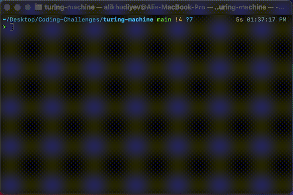

# Palindrome

If the given string is a palindrome then all cells are going to be filled with the blank symbols, otherwise, "X" is going to occur in the place where the condition for being a palindrome is not satisfied.

String to be tested: **a c a b a b a c a**

String to be tested: **a c a b a c a c a**

